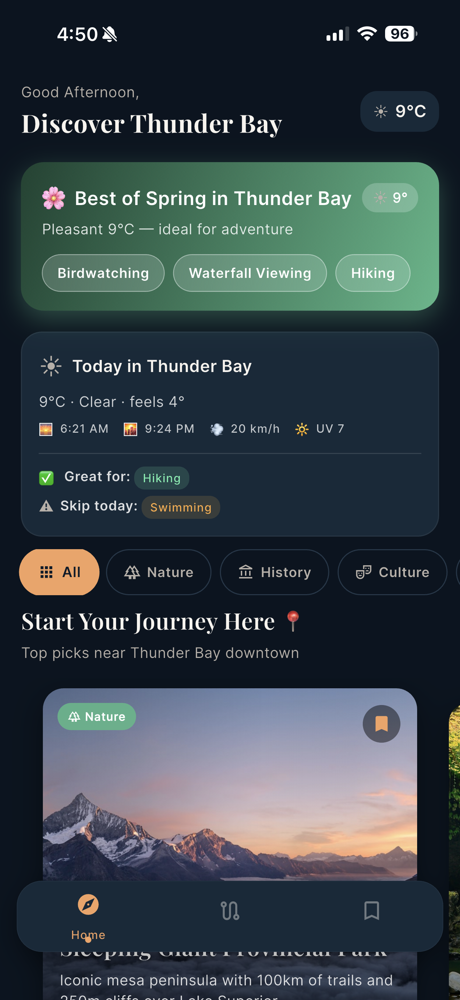
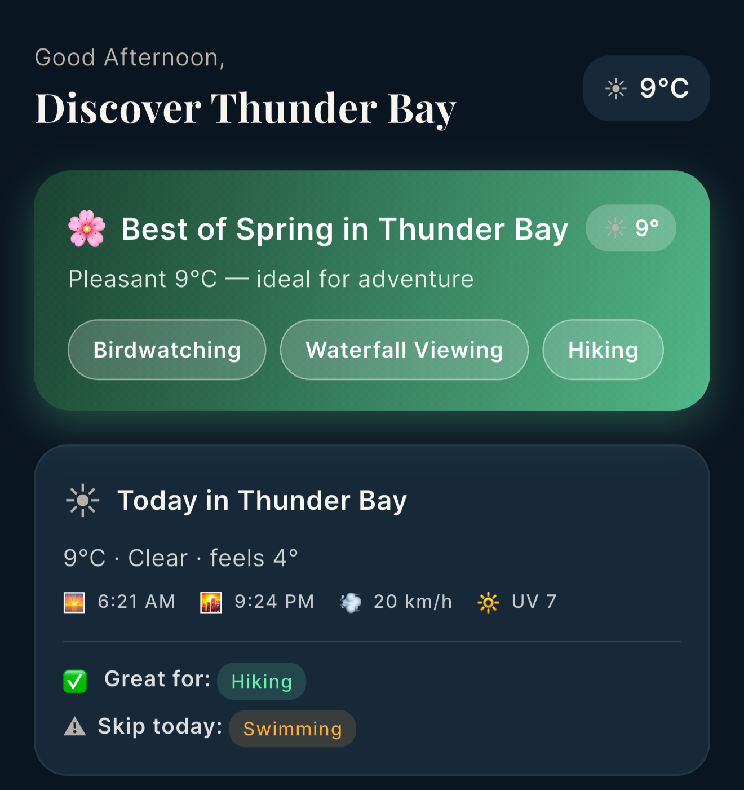
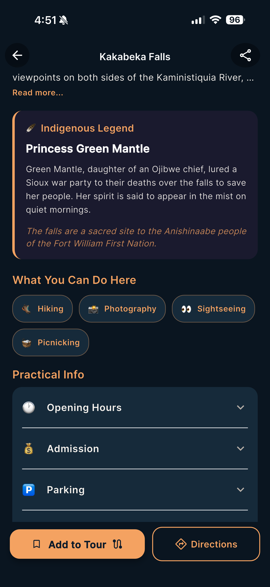
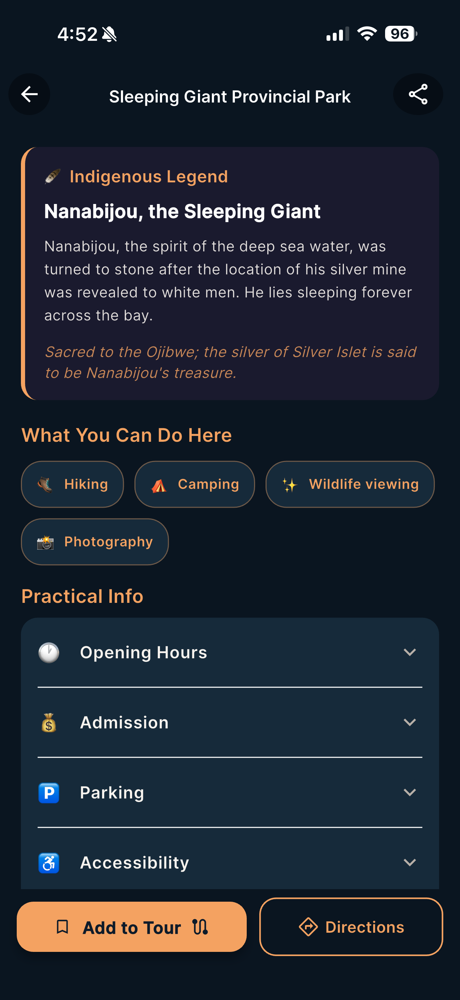
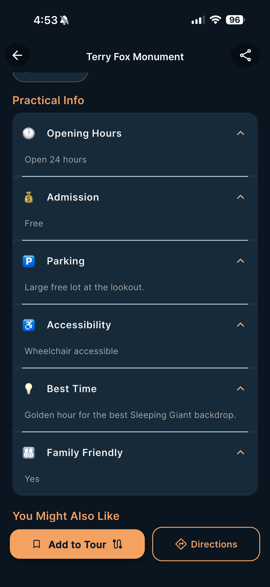
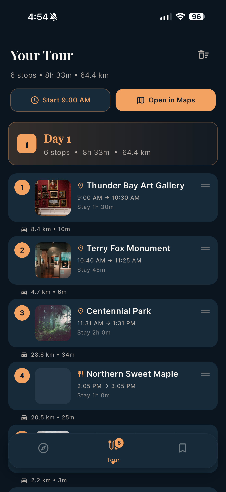
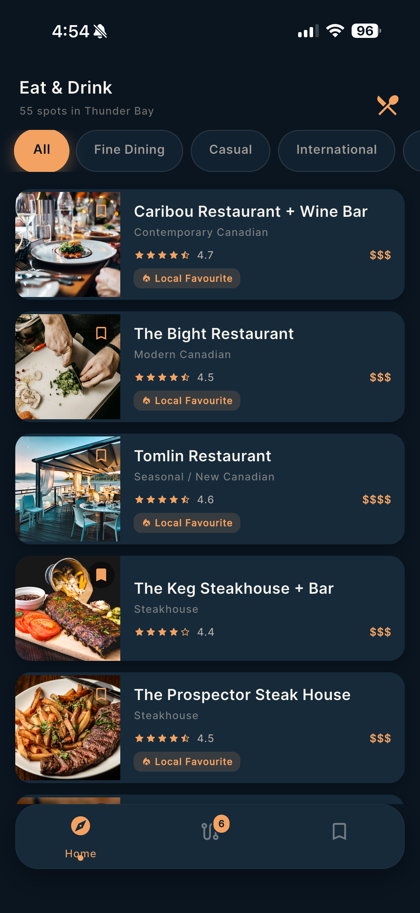
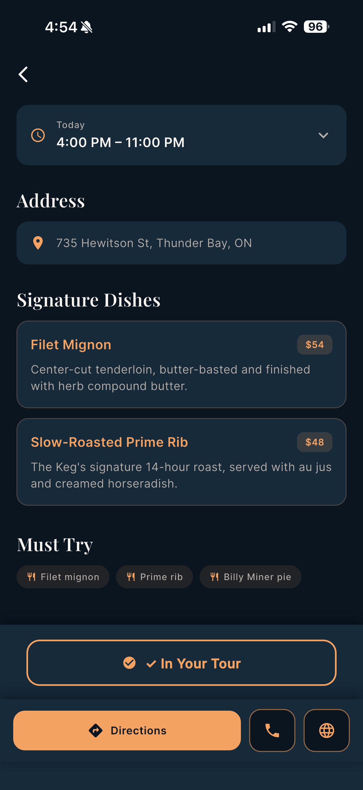
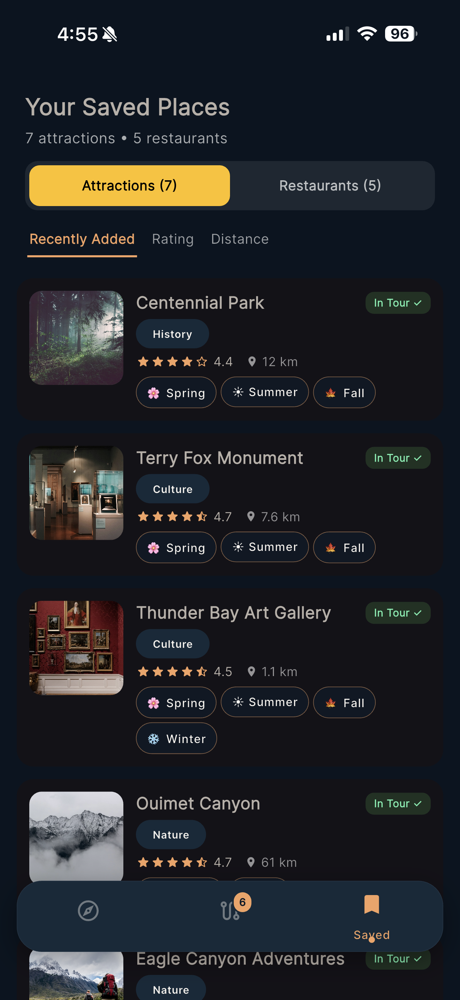

<p align="center">
  
</p>

<h1 align="center">🏔️ Thunder Bay Tours</h1>

<p align="center">
  <em>Your Intelligent Travel Companion for Thunder Bay, Ontario 🇨🇦</em>
</p>

<p align="center">
  
  
  
  
  
</p>

<p align="center">
  
  
  
  
</p>

---

## 📖 Table of Contents

- [Overview](#-overview)
- [Key Features](#-key-features)
- [Screenshots](#-screenshots)
- [Tech Stack](#-tech-stack)
- [Architecture](#-architecture)
- [Project Structure](#-project-structure)
- [Installation & Setup](#-installation--setup)
- [Usage Guide](#-usage-guide)
- [Key Algorithms](#-key-algorithms)
- [Future Enhancements](#-future-enhancements)
- [Contributing](#-contributing)
- [Team & Credits](#-team--credits)
- [License](#-license)

---

## 🌍 Overview

**Thunder Bay Tours** is a cross-platform mobile tourism guide application built with **Flutter/Dart** for [Thunder Bay, Ontario, Canada](https://en.wikipedia.org/wiki/Thunder_Bay). It serves as a comprehensive travel companion that helps visitors and locals discover attractions, plan multi-day tours, find local restaurants, and explore **Indigenous cultural stories** — all powered by intelligent algorithms and real-time weather data.

### 🎯 Core Value Propositions

| Feature | Description |
|---------|-------------|
| 🧠 **Intelligent Tour Planning** | Auto-orders saved attractions using a Greedy Nearest Neighbor algorithm with Haversine distance |
| 🪶 **Indigenous Cultural Storytelling** | Features Anishinaabe legends (Nanabijou, Princess Green Mantle, Animiki) with respectful cultural context |
| 🌦️ **Weather-Aware Recommendations** | Real-time weather from Open-Meteo API scores attractions for current conditions |
| 🍂 **Season-Aware Content** | Dynamically adjusts UI, recommendations, and badges based on the current season |
| 🍽️ **Full Restaurant Guide** | 55 curated Thunder Bay restaurants with signature dishes, weekly hours, and meal-slot tour integration |

> Built as an academic group project at **Lakehead University**, Thunder Bay Tours demonstrates production-quality architecture, polished animations, and a sophisticated feature set.

---

## ✨ Key Features

### 🏠 Discovery Hub (Home Screen)
- **Season Banner** — Dynamic banner showing current season with activity recommendations
- **Weather Insights Card** — Real-time weather with outdoor/hiking/water suitability indicators
- **Category Filters** — Filter by Nature, History, Culture, Waterfront, Indigenous
- **Featured Carousel** — Top-rated attractions with hero images and ratings
- **Near You Section** — Nearest attractions sorted by Haversine distance
- **Weather-Scored Grid** — Attraction cards with fit badges (*"Perfect today"*, *"Better indoors"*, *"Off-season"*)
- **Restaurant Row** — Curated dining highlights with horizontal scroll
- **Indigenous Spotlight** — Dedicated section highlighting Indigenous cultural sites
- **Pull-to-Refresh** — Live weather data refresh

### 📍 Smart Tour Planner
- **Multi-Day Itinerary** — Automatically splits stops across days based on a 10-hour daily budget
- **Greedy Nearest Neighbor Algorithm** — Optimally orders attractions starting from downtown Thunder Bay
- **Meal-Slot Integration** — Classifies restaurants as breakfast/lunch/dinner and inserts at correct timeline positions
- **Travel Time Estimation** — Haversine distance with road factor adjustments
- **Missing Meals Banner** — Smart alerts when tour overlaps meal windows without a restaurant stop
- **Custom Start Time** — User-adjustable tour start time
- **Multi-Stop Google Maps** — "Open in Maps" for the entire route with waypoints

### 🪶 Indigenous Storytelling
- **Nanabijou (Sleeping Giant)** — The Ojibwe legend of a giant spirit turned to stone
- **Princess Green Mantle (Kakabeka Falls)** — Story of an Ojibwe chief's daughter who saved her people
- **Animiki (Mount McKay)** — Thunder Bird spiritual stories
- Cultural notes and respectful storytelling connected to Fort William First Nation heritage

### 🍽️ Restaurant Discovery
- **55 curated restaurants** across 11 categories: Fine Dining, Casual, International, Brewery, Cocktail Bar, Bakery, Café, Market, Indigenous, Specialty, Vegetarian
- **Signature Dish Cards** — Detailed descriptions with pricing
- **Weekly Hours** — Day-by-day operating hours
- **Save & Add to Tour** — Seamless integration with the tour planner

### 💾 Persistent Save System
- SharedPreferences-backed JSON persistence
- **Cross-Screen Sync** — Riverpod reactive state across Home ↔ Tour ↔ Saved ↔ Detail screens
- **Sort Options** — Recently added, rating, distance
- **Smart Tour Optimizer** — Auto-reorders on add/remove

### 🌦️ Weather Integration
- **Open-Meteo API** — Free, no-API-key weather data for Thunder Bay
- **WMO Weather Codes** — Mapped to human labels and emoji
- **Activity Suitability Scoring** — Outdoor, hiking, and water activity fitness
- **Attraction Scoring** — Weather + season + category = dynamic fitness score

### ✨ Design & Animations
- **Dark Theme** — Lake Superior-inspired palette (Deep Blue `#0D1B2A`, Forest Green `#1B4332`, Amber Gold `#F4A261`)
- **Category Color Coding** — Nature 🟢, History 🟤, Culture 🟣, Waterfront 🔵, Indigenous 🟠
- **Flutter Animate** — Staggered reveals, fades, slides, scale animations
- **Particle Burst** — Custom particle animation on save actions
- **Shimmer Loading** — Skeleton loading cards for smooth UX
- **Spring Micro-Interactions** — Tactile button feedback

---

## 📸 Screenshots

### Splash & Home Screen

<p align="center">
  
  &nbsp;&nbsp;
  
</p>
<p align="center">
  <sub><b>Left:</b> Animated splash with branded logo &nbsp;|&nbsp; <b>Right:</b> Discovery Hub with weather, seasons & category filters</sub>
</p>

### Weather & Season Integration

<p align="center">
  
</p>
<p align="center">
  <sub>Desktop view — Real-time weather insights, season-aware banner, activity recommendations</sub>
</p>

### Attraction Details & Indigenous Storytelling

<p align="center">
  
  &nbsp;&nbsp;
  
  &nbsp;&nbsp;
  
</p>
<p align="center">
  <sub><b>Left:</b> Kakabeka Falls with SliverAppBar hero &nbsp;|&nbsp; <b>Center:</b> Indigenous Legend of Princess Green Mantle &nbsp;|&nbsp; <b>Right:</b> Sleeping Giant Provincial Park</sub>
</p>

<p align="center">
  
  &nbsp;&nbsp;
  
  &nbsp;&nbsp;
  
</p>
<p align="center">
  <sub><b>Left:</b> Legend of Nanabijou &nbsp;|&nbsp; <b>Center:</b> Terry Fox Monument &nbsp;|&nbsp; <b>Right:</b> Practical information section</sub>
</p>

### Smart Tour Planner

<p align="center">
  
</p>
<p align="center">
  <sub>Multi-day tour itinerary — Greedy Nearest Neighbor optimized route with travel times & meal suggestions</sub>
</p>

### Restaurant Discovery

<p align="center">
  
</p>
<p align="center">
  <sub>55 curated restaurants with 11 category filters, ratings, and price indicators</sub>
</p>

<p align="center">
  
  &nbsp;&nbsp;
  
</p>
<p align="center">
  <sub><b>Left:</b> Restaurant detail with hours & description &nbsp;|&nbsp; <b>Right:</b> Signature dishes with pricing</sub>
</p>

### Saved Places & Filtering

<p align="center">
  
  &nbsp;&nbsp;
  
</p>
<p align="center">
  <sub><b>Left:</b> Saved places with sort options & tour badges &nbsp;|&nbsp; <b>Right:</b> Indigenous category filter active</sub>
</p>

---

## 🛠️ Tech Stack

### Framework & Language

| Component | Technology | Version |
|-----------|-----------|---------|
| Framework | Flutter | ≥ 3.22.0 |
| Language | Dart | ≥ 3.4.0, < 4.0.0 |
| Platforms | Android, iOS, Web, Linux, macOS, Windows | Multi-platform |

### Key Dependencies

| Package | Purpose |
|---------|---------|
| [`flutter_riverpod`](https://pub.dev/packages/flutter_riverpod) | Reactive state management with providers |
| [`go_router`](https://pub.dev/packages/go_router) | Declarative routing with `StatefulShellRoute` bottom nav |
| [`shared_preferences`](https://pub.dev/packages/shared_preferences) | Local persistent storage for saved items & tours |
| [`flutter_animate`](https://pub.dev/packages/flutter_animate) | Declarative animations (staggered reveals, fades, slides) |
| [`shimmer`](https://pub.dev/packages/shimmer) | Skeleton loading animations |
| [`cached_network_image`](https://pub.dev/packages/cached_network_image) | Efficient network image caching |
| [`google_fonts`](https://pub.dev/packages/google_fonts) | Custom typography via Google Fonts |
| [`timeline_tile`](https://pub.dev/packages/timeline_tile) | Timeline UI for tour itinerary display |
| [`http`](https://pub.dev/packages/http) | HTTP client for Open-Meteo weather API |
| [`url_launcher`](https://pub.dev/packages/url_launcher) | Launch maps, phone, and web links |
| [`percent_indicator`](https://pub.dev/packages/percent_indicator) | Circular/linear progress indicators |
| [`intl`](https://pub.dev/packages/intl) | Date/time formatting and internationalization |

### Dev Dependencies

| Package | Purpose |
|---------|---------|
| `flutter_test` | Unit and widget testing framework |
| `flutter_lints` | Code quality lint rules |
| `flutter_launcher_icons` | App icon generation tool |

---

## 🏗️ Architecture

Thunder Bay Tours follows **Clean Architecture** with a clear 4-layer separation of concerns:

```
┌─────────────────────────────────────────────────────┐
│                   PRESENTATION                       │
│     Screens • Widgets • Riverpod Providers           │
│     (UI logic, user interaction, state binding)      │
├─────────────────────────────────────────────────────┤
│                      DOMAIN                          │
│     Models (Attraction, Restaurant, TourStop, etc.)  │
│     (Pure Dart — no framework dependencies)          │
├─────────────────────────────────────────────────────┤
│                       DATA                           │
│     Repositories • DataSources • Services            │
│     (Data access, API calls, local storage)          │
├─────────────────────────────────────────────────────┤
│                       CORE                           │
│     Theme • Constants • Enums • Utils • Animations   │
│     (Shared utilities across all layers)             │
└─────────────────────────────────────────────────────┘
```

### Layer Responsibilities

| Layer | Directory | Responsibility |
|-------|-----------|---------------|
| **Core** | `lib/core/` | Theme (dark/light), constants, enums (Category, Season, Difficulty, MealSlot), utilities (distance, season, scoring), animation presets |
| **Domain** | `lib/domain/` | Pure data models — `Attraction`, `Restaurant`, `SavedItem`, `TourStop`, `TourDay`, `TourRoute` |
| **Data** | `lib/data/` | Hardcoded Thunder Bay data (25 attractions, 55 restaurants), repositories with CRUD/query, Open-Meteo weather service |
| **Presentation** | `lib/presentation/` | 7 screens, 30+ widgets, Riverpod providers for attractions, saved items, tour planning, weather, sorting |

### State Management Flow

```
User Action → Provider Method → Repository → Data Source
                    ↓
             State Update → Riverpod notifyListeners()
                    ↓
             Widget Rebuild (reactive UI)
```

### Navigation Architecture
- **GoRouter** with `StatefulShellRoute.indexedStack()` for persistent bottom navigation
- 3 shell tabs: **Home** • **Tour** • **Saved**
- Full-screen routes for Attraction Detail and Restaurant Detail (outside shell)

---

## 📂 Project Structure

```
ThunderBayTour/
├── lib/
│   ├── main.dart                              # App entry point, SharedPreferences init
│   ├── app.dart                               # GoRouter config, MaterialApp, theme setup
│   ├── core/
│   │   ├── animations/
│   │   │   └── animation_presets.dart          # Reusable animation configs
│   │   ├── constants/
│   │   │   └── app_constants.dart              # Downtown coords, prefs keys, app name
│   │   ├── enums/
│   │   │   ├── category.dart                   # Nature / History / Culture / Waterfront / Indigenous
│   │   │   ├── difficulty.dart                 # Easy / Moderate / Challenging
│   │   │   ├── meal_slot.dart                  # Breakfast / Lunch / Snack / Dinner
│   │   │   ├── saved_item_type.dart            # Attraction / Restaurant
│   │   │   └── season.dart                     # Spring / Summer / Fall / Winter
│   │   ├── theme/
│   │   │   ├── app_colors.dart                 # Lake Superior-inspired color palette
│   │   │   ├── app_text_styles.dart            # Typography system
│   │   │   └── app_theme.dart                  # Light + Dark ThemeData
│   │   └── utils/
│   │       ├── activity_icon_utils.dart        # Activity → icon mapping
│   │       ├── attraction_scorer.dart          # Weather+season scoring algorithm
│   │       ├── distance_utils.dart             # Haversine distance calculator
│   │       ├── maps_launcher.dart              # Google Maps/phone/multi-stop launcher
│   │       └── season_utils.dart               # Current season detection
│   ├── data/
│   │   ├── datasources/
│   │   │   ├── thunder_bay_data.dart           # 25 hardcoded attractions (full metadata)
│   │   │   ├── restaurants_data_part1.dart     # Restaurant data (batch 1)
│   │   │   └── restaurants_data_part2.dart     # Restaurant data (batch 2)
│   │   ├── repositories/
│   │   │   ├── attractions_repository.dart     # CRUD + query for attractions
│   │   │   ├── restaurants_repository.dart     # CRUD + query for restaurants
│   │   │   └── saved_repository.dart           # SharedPreferences persistence
│   │   └── services/
│   │       └── weather_service.dart            # Open-Meteo API client
│   ├── domain/
│   │   └── models/
│   │       ├── attraction.dart                 # Attraction (25+ fields, Indigenous legends)
│   │       ├── restaurant.dart                 # Restaurant (dishes, hours, coordinates)
│   │       ├── saved_item.dart                 # SavedItem (JSON serializable)
│   │       ├── tour_day.dart                   # TourDay (per-day stops, meal coverage)
│   │       ├── tour_route.dart                 # TourRoute (multi-day aggregation)
│   │       └── tour_stop.dart                  # TourStop (arrival, travel, meal slot)
│   └── presentation/
│       ├── providers/                          # Riverpod state management
│       │   ├── attractions_provider.dart       # Filtered/scored attractions
│       │   ├── date_context_provider.dart      # Season/time-of-day context
│       │   ├── restaurants_provider.dart       # Restaurant list + filters
│       │   ├── saved_provider.dart             # Save/unsave, tour management
│       │   ├── sort_provider.dart              # Sort options
│       │   ├── tour_planner_provider.dart      # Multi-day tour builder
│       │   └── weather_provider.dart           # Weather data fetching
│       ├── screens/
│       │   ├── splash/                         # Animated splash screen
│       │   ├── home/                           # Discovery Hub + 9 widgets
│       │   ├── detail/                         # Attraction detail + 9 widgets
│       │   ├── restaurant_detail/              # Restaurant detail + 4 widgets
│       │   ├── restaurants/                    # Restaurant list + 2 widgets
│       │   ├── tour/                           # Tour planner + 8 widgets
│       │   └── saved/                          # Saved places + 4 widgets
│       └── shared_widgets/                     # Reusable UI components (7 widgets)
├── screenshots/                                # App screenshots for documentation
├── android/ ios/ web/ linux/ macos/ windows/   # Platform-specific files
├── pubspec.yaml                                # Dependencies & configuration
└── README.md                                   # This file
```

---

## 🚀 Installation & Setup

### Prerequisites

| Requirement | Details |
|-------------|---------|
| **Flutter SDK** | ≥ 3.22.0 ([Install Guide](https://docs.flutter.dev/get-started/install)) |
| **Dart SDK** | ≥ 3.4.0 (bundled with Flutter) |
| **IDE** | Android Studio / IntelliJ IDEA / VS Code with Flutter plugin |
| **Device** | Android Emulator (API 24+), iOS Simulator, Chrome (web), or physical device |
| **Git** | For version control |
| **Internet** | Required for weather API and network images |

### Step-by-Step Installation

```bash
# 1. Clone the repository
git clone https://github.com/ro4ithan/ThunderBayTour.git

# 2. Navigate to the project directory
cd ThunderBayTour

# 3. Install dependencies
flutter pub get

# 4. Verify Flutter setup
flutter doctor

# 5. Run the app
flutter run
```

### IDE Setup

#### VS Code
1. Install the **Flutter** extension by Dart Code
2. Open the `ThunderBayTour/` folder
3. Flutter SDK is auto-detected (set path in settings if needed)
4. Select target device from the status bar
5. Press `F5` or `Ctrl+F5` to launch

#### Android Studio / IntelliJ IDEA
1. Install the **Flutter** and **Dart** plugins
2. Open the `ThunderBayTour/` folder as a project
3. Configure Flutter SDK path in plugin settings
4. Select your emulator/device from the device dropdown
5. Click the **Run ▶️** button

### Platform-Specific Commands

```bash
# Run on Android
flutter run -d android

# Run on iOS (macOS only)
flutter run -d ios

# Run on Chrome (Web)
flutter run -d chrome

# Run on Desktop
flutter run -d linux    # Linux
flutter run -d macos    # macOS
flutter run -d windows  # Windows
```

### Environment Notes
- ✅ **No API keys required** — Uses Open-Meteo (free, no auth)
- ✅ **No backend server** — All attraction/restaurant data is hardcoded locally
- ✅ **No database setup** — SharedPreferences handles local persistence
- ⚠️ **Internet required** — For weather API and Unsplash CDN images

---

## 📱 Usage Guide

### App Screens

| Screen | Description |
|--------|-------------|
| **🚀 Splash** | Animated logo reveal with staggered text and loading bar (3-second auto-transition) |
| **🏠 Home** | Discovery Hub — season banner, weather insights, category filters, featured carousel, attraction grid, restaurant row, Indigenous spotlight |
| **📍 Attraction Detail** | SliverAppBar hero, animated stats, Indigenous legends, activities, gallery, practical info, save button with particle burst |
| **🍽️ Restaurant Detail** | Full info with signature dishes, weekly hours, action bar (directions, call, save) |
| **🗺️ Tour** | Timeline view with smart ordering, per-stop timing, travel estimates, multi-day splitting, meal integration |
| **💾 Saved** | Sortable list (recently added / rating / distance) with swipe-to-delete and undo |
| **🍴 Restaurants** | Full restaurant listing with 11 category filter chips |

### Quick Workflow

1. **Browse** — Explore attractions on the Home screen, filter by category
2. **Discover** — Tap an attraction to see details, Indigenous legends, and activities
3. **Save** — Tap "Add to Tour" to save attractions and restaurants
4. **Plan** — Visit the Tour tab to see your auto-optimized itinerary
5. **Navigate** — Use "Open in Maps" for turn-by-turn Google Maps directions

---

## 🧠 Key Algorithms

### Greedy Nearest Neighbor Tour Optimization

The tour planner uses a **Greedy Nearest Neighbor** algorithm to order saved attractions into an efficient route:

```
Algorithm: GreedyNearestNeighborTour
────────────────────────────────────
Input:  Set of saved attractions with (lat, lng) coordinates
Start:  Thunder Bay Downtown (48.3809°N, 89.2477°W)

1. current ← downtown Thunder Bay
2. unvisited ← all saved attractions
3. route ← []

4. WHILE unvisited is not empty:
   a. nearest ← argmin(haversine(current, u)) for u in unvisited
   b. route.append(nearest)
   c. unvisited.remove(nearest)
   d. current ← nearest

5. RETURN route
```

### Haversine Distance Formula

Used throughout for straight-line distance calculations between coordinates:

```
d = 2r × arcsin(√(sin²((φ₂-φ₁)/2) + cos(φ₁)cos(φ₂)sin²((λ₂-λ₁)/2)))
```

- **Road factor:** 1.4× applied to straight-line distance for realistic travel estimates
- **Speed model:** 50 km/h average driving speed

### Weather-Aware Attraction Scoring

```
Algorithm: AttractionScorer
───────────────────────────
Input:  Attraction data, current weather, current season
Factors:
  - Category weight (outdoor vs indoor)
  - Weather conditions (stormy/rainy/overcast/clear)
  - Temperature comfort range
  - Wind speed
  - Precipitation probability
  - Season suitability

Output: Numeric score + fit label
  → Perfect Today | Good Fit | Okay | Better Indoors | Off-Season
```

### Multi-Day Tour Splitting

- **Daily budget:** 10 hours per day
- Cumulative time tracked (travel + visit durations)
- When budget exceeded → new day created
- Restaurants classified by meal type and inserted at correct timeline positions

---

## 🔮 Future Enhancements

| Priority | Enhancement | Description |
|----------|------------|-------------|
| 🔴 High | **User Accounts** | Firebase authentication + cloud sync |
| 🔴 High | **Full Offline Mode** | Pre-cached assets for no-internet usage |
| 🟡 Medium | **AR Viewfinder** | Augmented reality overlay for nearby attractions |
| 🟡 Medium | **Multi-Language** | English/French bilingual support (EN/FR) |
| 🟡 Medium | **Push Notifications** | Seasonal event alerts and tour reminders |
| 🟢 Low | **Social Sharing** | Share tours and saved lists with friends |
| 🟢 Low | **Reviews & Ratings** | User-generated reviews for attractions |
| 🟢 Low | **Accessibility Audit** | Full WCAG 2.1 AA compliance |

---

## 🤝 Contributing

Contributions are welcome! Here's how to get started:

1. **Fork** the repository
2. **Create** a feature branch (`git checkout -b feature/amazing-feature`)
3. **Commit** your changes (`git commit -m 'Add amazing feature'`)
4. **Push** to the branch (`git push origin feature/amazing-feature`)
5. **Open** a Pull Request

### Guidelines
- Follow existing code structure and Clean Architecture layers
- Use Riverpod for state management (no `setState`)
- Write descriptive commit messages
- Add comments for complex logic
- Test on at least one platform before submitting

---

## 👥 Team & Credits

This project was developed as a group project by a 9-member team at Lakehead University, Thunder Bay, Ontario.

| Role | Contributor |
|------|-------------|
| Instructor | Dr. Sabah Mohammed (Professor & Professional Engineer), Department of Computer Science |
| Team Members | Rathnaraja, Rohithan (1315170) <br> Ravi, Harika (1332239) <br> Ren, Anyang (1287290) <br> Ren, Yue (1269195) <br> Sah, Shraban Kumar (1337882) <br> Sardar, Md Shepon (1329219) <br> Sayfiddinov, Kuvondik (1308773) <br> Sharma, Chiragkumar Premraj (1313032) <br> Sharma, Vaibhav (1337173) |
| Course | (2026S) COMP-5450-SA — Mobile Programming |
| Location | Thunder Bay, Ontario, Canada 🇨🇦 |

### Acknowledgements
- 🪶 **Fort William First Nation** — For the Indigenous cultural stories and heritage that enrich this application
- 🌐 **Open-Meteo** — Free weather API powering real-time weather integration
- 📸 **Unsplash** — Community-sourced photography for attraction imagery
- 🎨 **Flutter Team** — For the amazing cross-platform framework

---

## 📄 License

This project is developed for academic purposes at Lakehead University. All rights reserved.

Indigenous stories and cultural content are shared with respect and are rooted in the oral traditions of the **Anishinaabe people** of the Thunder Bay region. We encourage respectful engagement with these narratives.

---

<p align="center">
  <b>🏔️ Thunder Bay Tours</b> — Explore. Discover. Experience.
</p>
<p align="center">
  Made with ❤️ and Flutter in Thunder Bay, Ontario 🇨🇦
</p>
